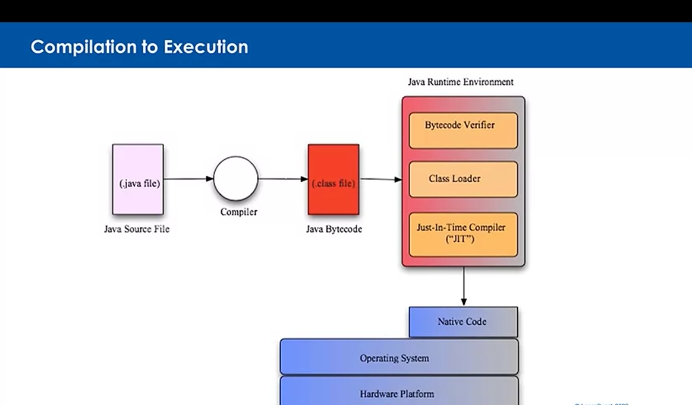

# Key Java Benefits

* Write Once Run Anywhere (WORA)
* Object-Orientation
* Familiar C/C++ based syntax
* Rich Libraries
* Security
* Internationalization
* Performance 
* It's Free
* A Community process for expanding Java

##### Write-Once Run Anywhere

* A Java Application is hosted on a Java Virtual Machine (JVM)

* The code is compiled into an "intermediate format" called architechture-neutral "bytecodes"

* Developers write code for Java platform rather than a specific platform.

* The bytecodes are executed by JVM and the bytecode instructions are translated into native machine code by the Java Runtime Environment (JRE)

##### Compilation to Execution

 The <strong>WORA</strong> philosophy allows compiled JAVA code to be compiled for the JVM and run in any JRE environment.

##### Java Packages

* Packages are Java's platform-neutral version of directories.

* We will be looking at many Java classes. Those classes are organized into packages. Think of a package the way you would look at a directory. You can have many files into directory just as you can have many classes in a package. It's just that directories are platform specific and Java wanted some form of platform neutral understanding. That is the role of a Java package.

* In a file system we might use slashes. Windows uses backslash is or can actually accept forward slashes. Other systems went forward slashes to separate the parts of a directory path. In Java, we use the dot, com.learnquest.calculator.util. We will be talking about a com directory with a child directory of learnquest, and then a further child directory of calculator, and then a final child directory of util.

* Real-world Java programs may use dozens or as they say, hundreds of individual classes. Each class packaged into a file. Packages help us group these classes in meaningful manners and help us also to avoid name collisions. After all, here you see a calculator. How many different companies might have created something calling it calculator? That is why the standard is to use your domain name reversed. If you are learnquest.com, you start with com.learnquest. If you are Coursera, it would be com.coursera. If you are some other company, or for example, the Apache Software Foundation, org.apache.

##### Familiar C/C++ Syntax

* Java's syntax is very similar to the C family of languages.
* C/C++ developers are able to learn Java quickly.
* Java includes same datatypes as C:int, float double e.t.c.,.
* In Java, these non-object data types are called primitives or built-in datatypes.
* Ints, floats doubles are primitives. Java also provides object representations called integer Float with a capital, Double with a capital. For each primitive, we will see that there's also a wrapper class. In terms of programming statements and structure.
* In terms of programming statements and structure. It is very much the similar as C with some things borrowed as well from C plus plus, such as exception handling. Many of the statements many of the keywords and operators are taken straight from C. Java comes with a rich set of libraries, string manipulations, calendars, text, handling, XML parsing, and many, many, many, many other things.

##### Rich Library Support

* Java provides a comprehensive set of libraries as part of the standard distribution.

* These offerings are enhanced with a HUGE selection of reliable and supported open source libraries. 

##### Library Standards

* Many of the Java Libraries are based on standards developed within and by the Java community.

* The Java Community Process (JCP) defines:
    - A specification of the API: Interfaces & Required Behaviour.

* Designed to enhance portability by promoting vendor independence.

* Standards-compliant vendors are expected to support this required behaviour but the standard will generally not specify HOW it should be implemented

##### JDBC: Java Database Connectivity

    * JDBC packages are a key offering found in java.sql and included as port of the standard Java distribution.

    * This package facilitates database-neutral interaction with a relational database.

    * The package provides a set of interfaces that have been standardized by the JDBC specification.

    * The required behaviour is specified by the specification.

    * The actual implementation of this behaviour is determined by the database vendor or some other standards-compliant 3rd party.